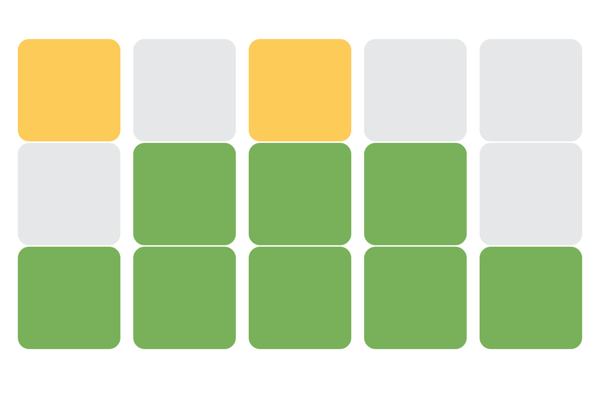
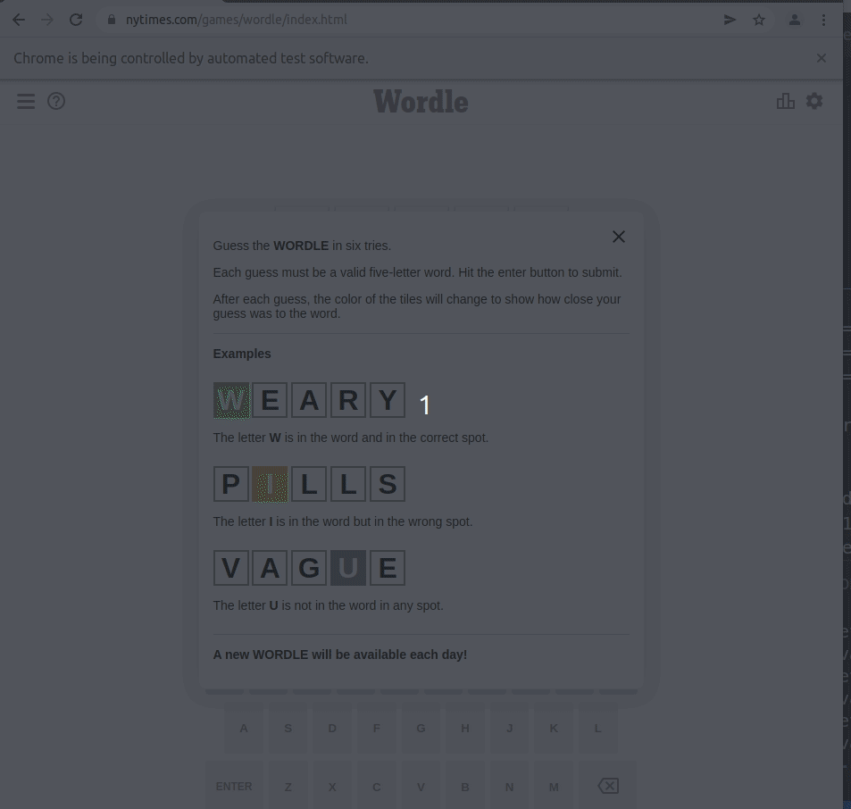

<div id="top"></div>
<br />
<div align="center">
    
    <h1 align="center">Wordle Bot</h1>
</div>

### About The Project

This project contains an abstract game simulator class to implement custom AI to generate guesses. Please see ```example.py``` for example on how to overwrite 
```python get_next_guess(self, guesses, pattern)```

Use selenium to automate the game within browser.

The AI strategy is based off of the scores derived from 
[the documentation](https://www.mynl.com/static/blog/wordle.html) ```generate_scores.py``` will generate score csv.


